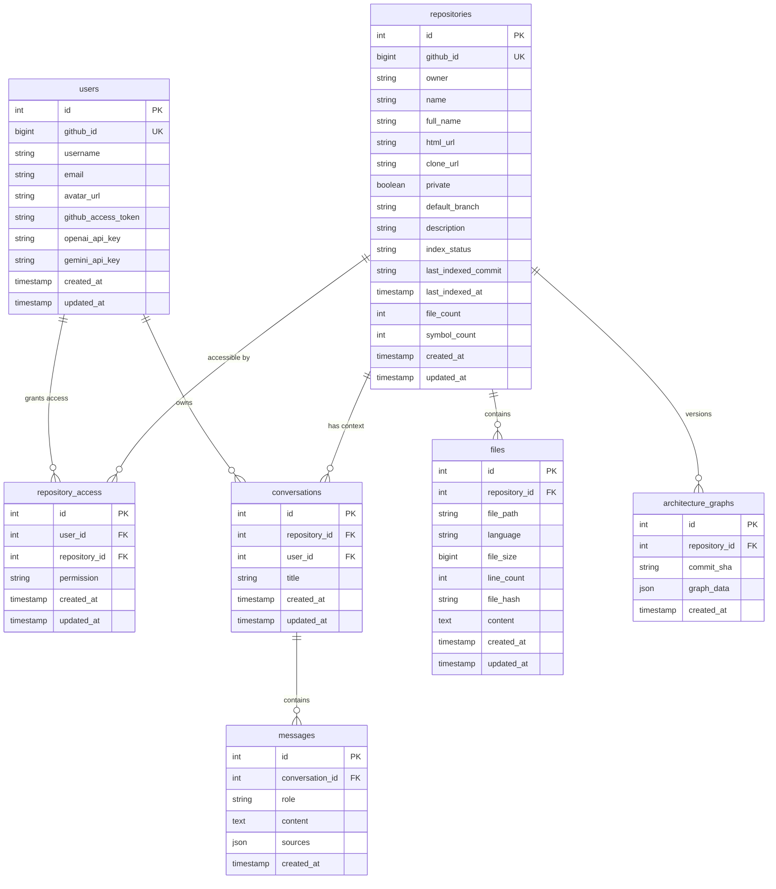

# 06. Database Schema & Vector Store Architecture

> **Document Type:** Database Blueprint & Vector Store Specification  
> **Target Version:** 1.0.0  
> **Status:** Active & Implemented  

---

## 1. Relational Database Overview

CodeLens utilizes **PostgreSQL 16** (with SQLite fallback for local developer velocity) managed via **SQLAlchemy 2.0 ORM** ([`backend/app/db/models.py`](file:///d:/Shoaib/CodeLens/backend/app/db/models.py)).

### 1.1 Entity-Relationship (ER) Diagram



---

## 2. Relational Table Specifications

### 2.1 Table: `users`
Stores user identities authenticated through GitHub OAuth2 and securely encrypted Bring-Your-Own-Key (BYOK) configurations.

| Column | Type | Constraints | Description |
|---|---|---|---|
| `id` | `Integer` | `PK`, `autoincrement` | Internal primary identifier |
| `github_id` | `BigInteger` | `UNIQUE`, `NOT NULL`, `INDEX` | Unique GitHub account ID |
| `username` | `String(255)`| `NOT NULL`, `INDEX` | GitHub handle |
| `email` | `String(255)`| `NULLABLE` | Verified primary email address |
| `avatar_url` | `String(500)`| `NULLABLE` | Profile image URL |
| `github_access_token`| `String(500)`| `NULLABLE` | GitHub OAuth access token |
| `openai_api_key` | `String(500)`| `NULLABLE` | AES-256 encrypted personal OpenAI key |
| `gemini_api_key` | `String(500)`| `NULLABLE` | AES-256 encrypted Gemini key alias |
| `created_at` | `DateTime` | `DEFAULT now()`, `NOT NULL` | Registration timestamp |
| `updated_at` | `DateTime` | `DEFAULT now()`, `NOT NULL` | Last update timestamp |

### 2.2 Table: `repositories`
Tracks imported repositories, indexing states, and metrics.

| Column | Type | Constraints | Description |
|---|---|---|---|
| `id` | `Integer` | `PK`, `autoincrement` | Repository unique ID |
| `github_id` | `BigInteger` | `UNIQUE`, `NOT NULL`, `INDEX` | GitHub repository identifier |
| `owner` | `String(255)`| `NOT NULL` | Repository owner or organization |
| `name` | `String(255)`| `NOT NULL` | Repository name |
| `full_name` | `String(500)`| `NOT NULL`, `INDEX` | Canonical slug (e.g. `facebook/react`) |
| `html_url` | `String(500)`| `NOT NULL` | Web URL on GitHub |
| `clone_url` | `String(500)`| `NOT NULL` | HTTPS clone endpoint |
| `private` | `Boolean` | `DEFAULT False`, `NOT NULL` | Privacy flag |
| `default_branch`| `String(255)`| `DEFAULT 'main'`, `NOT NULL` | Default active branch |
| `description` | `String(1000)`| `NULLABLE` | Repository description |
| `index_status`| `String(50)` | `DEFAULT 'not_indexed'` | State: `not_indexed`, `indexing`, `indexed`, `failed` |
| `last_indexed_commit`| `String(100)`| `NULLABLE` | SHA-1 commit hash of last index run |
| `last_indexed_at` | `DateTime`| `NULLABLE` | Timestamp of last successful index |
| `file_count` | `Integer` | `DEFAULT 0`, `NOT NULL` | Total parsed source files |
| `symbol_count` | `Integer` | `DEFAULT 0`, `NOT NULL` | Total extracted functions & classes |

### 2.3 Table: `repository_access`
Enforces Multi-Tenant Access Control (RBAC).

- `UniqueConstraint("user_id", "repository_id", name="uq_user_repository_access")`
- `ForeignKey("users.id", ondelete="CASCADE")`
- `ForeignKey("repositories.id", ondelete="CASCADE")`

### 2.4 Table: `files`
Stores source code content and line metrics for in-app code viewing.

- `UniqueConstraint("repository_id", "file_path", name="uq_repository_file")`
- `Index("idx_files_repo_path", "repository_id", "file_path")`

### 2.5 Table: `architecture_graphs`
Stores serialized Architecture Knowledge Graphs pinned to specific Git commit SHAs.

- `UniqueConstraint("repository_id", "commit_sha", name="uq_repo_arch_commit")`
- `graph_data`: JSON payload containing all nodes, edges, layers, and evidence snippets.

### 2.6 Tables: `conversations` & `messages`
Maintains conversational RAG threads and stores AI responses with source code citation references.

---

## 3. Vector Database Architecture (Qdrant)

CodeLens uses **Qdrant Vector Database** ([`backend/app/rag/vector_store.py`](file:///d:/Shoaib/CodeLens/backend/app/rag/vector_store.py)) for dense vector similarity retrieval.

```
┌────────────────────────────────────────────────────────────────────────┐
│                        QDRANT VECTOR STORE                             │
│                                                                        │
│  • Collection Name: codelens_chunks                                    │
│  • Vector Dimension: 1536 (OpenAI text-embedding-3-small)             │
│  • Distance Metric: Cosine                                             │
│  • Index Payload: repository_id (Keyword Index for Tenant Isolation)   │
│  • Quantization: Scalar Quantization for memory efficiency             │
└────────────────────────────────────────────────────────────────────────┘
```

### 3.1 Point Payload Schema
Each vector point stored in Qdrant contains rich architectural metadata:

```json
{
  "id": "e9b2c34a-9b12-4f81-a3f1-d0b57e492b41",
  "vector": [0.0124, -0.0451, 0.0892, "... 1536 floats ..."],
  "payload": {
    "repository_id": 42,
    "file_path": "backend/app/services/indexer.py",
    "symbol_name": "index_repository",
    "symbol_type": "function",
    "start_line": 28,
    "end_line": 95,
    "line_count": 67,
    "content": "async def index_repository(repo_id: int, db: Session): ..."
  }
}
```

### 3.2 Tenant Isolation & Search Filtering
To ensure complete isolation between repositories, every vector search query enforces a strict Qdrant payload filter:

```python
from qdrant_client.http import models as qmodels

query_filter = qmodels.Filter(
    must=[
        qmodels.FieldCondition(
            key="repository_id",
            match=qmodels.MatchValue(value=repository_id),
        )
    ]
)

search_results = qdrant_client.search(
    collection_name="codelens_chunks",
    query_vector=query_embedding,
    query_filter=query_filter,
    limit=top_k,
    score_threshold=0.65,
)
```
